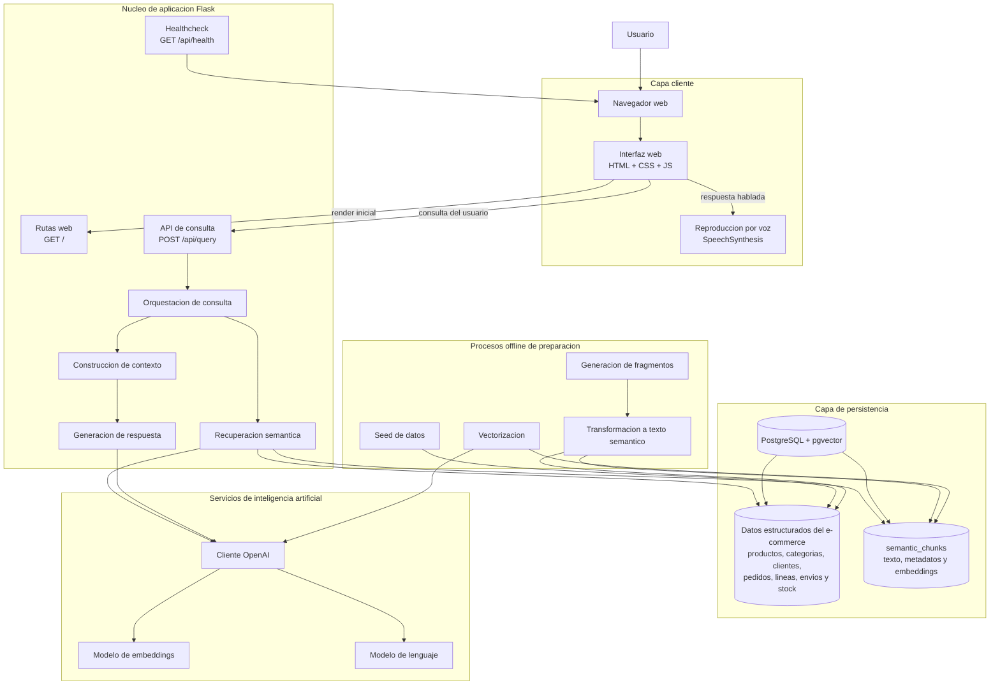

# Diagrama de arquitectura general

Este diagrama resume la arquitectura actual del sistema `El Naranjo` a partir del código del repositorio.

## Vista general

## Flujo online

1. El usuario abre la web y el navegador carga `index.html`, `app.css` y `app.js`.
2. La interfaz envía la consulta a `POST /api/query`.
3. El núcleo Flask orquesta el flujo RAG y genera el embedding de la consulta con OpenAI.
4. La búsqueda semántica consulta `semantic_chunks` en PostgreSQL usando similitud coseno sobre `pgvector`.
5. Los fragmentos recuperados se reordenan con heurísticas de negocio y se transforman en contexto.
6. El modelo de lenguaje genera la respuesta final a partir de la pregunta y del contexto recuperado.
7. La interfaz muestra respuesta, contexto y ranking; opcionalmente la reproduce por voz.

## Flujo offline

1. `seed_data.py` carga datos de catálogo, stock, clientes, pedidos y envíos en PostgreSQL.
2. `build_semantic_chunks.py` transforma productos, pedidos y envíos en fragmentos semánticos.
3. Los fragmentos se guardan en `semantic_chunks` con texto y metadatos.
4. `generate_embeddings.py` llama al modelo de embeddings y almacena los vectores en la misma tabla `semantic_chunks`.

## Decisiones arquitectónicas visibles en el código

- La aplicación usa una arquitectura monolítica: frontend servidor, API, lógica RAG y acceso a datos viven dentro de la misma app Flask.
- PostgreSQL actúa como base relacional y como almacén vectorial mediante `pgvector`; no hay un vector DB independiente.
- El pipeline RAG está separado en dos tiempos: indexación offline y consulta online.
- OpenAI se usa en dos capacidades distintas: embeddings para recuperación y generación para respuesta final.
